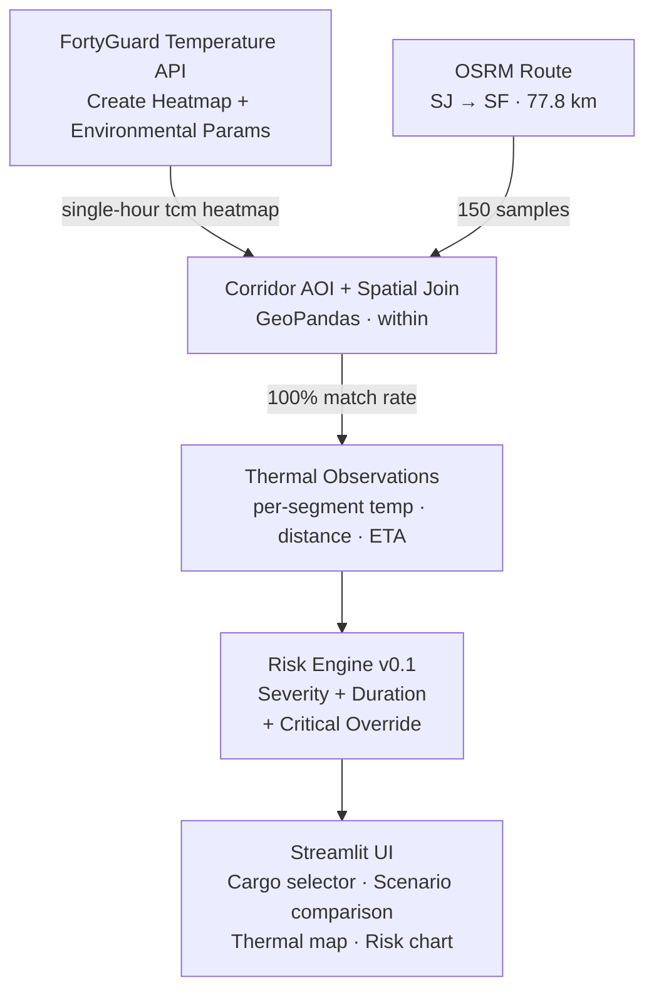

# 🌡️ Heat-to-Shelf

**Thermal Decision Intelligence for Heat-Sensitive Cargo**
*FortyGuard Global AI Hackathon 2026 — Track 3: Industrial & Enterprise*

> "A logistics route/temperature tool that protects heat-sensitive cargo and worker safety on last-mile routes" — this project is a direct response to FortyGuard's own listed Track 3 example.

**Live demo:** *[https://heat-to-shelf.streamlit.app/]*
**Demo video (≤3 min):** *[https://youtu.be/FTgLWbyd-Ok]*

---

## The Problem

Temperature-sensitive shipments leave based on a dispatcher's intuition about **city-wide** weather. But ambient temperature along a real route can vary far more than that single number suggests. On our validated corridor (San Jose → San Francisco, 77.8 km, 61 minutes), the same hour of the same day showed a **11.55°C spread** between the inland origin and the coastal destination — from 30.04°C down to 18.49°C.

The FDA's FSMA Sanitary Transportation Rule (2016) already requires shippers to specify written temperature requirements and carriers to monitor and retain 12-month records — but provides no tooling for *route-level* thermal analysis. Most dispatchers still decide departure time by checking one city's forecast.

**The question dispatchers actually need answered:** *given this cargo, this route, and this date — what time should this shipment leave?*

---

## Research Context & Motivation

### The scale of cold chain failure

The economic and environmental cost of temperature excursions during transport is well-documented:

- **~526 million tonnes** of food are lost annually due to insufficient refrigeration — roughly 12% of global production [4, 1].
- **13%** of all food produced globally is lost between harvest and retail, with transport and storage failures as primary contributors (FAO, 2019) [1].
- **15–20%** of temperature-sensitive pharmaceutical shipments experience at least one temperature excursion, contributing to an estimated **USD 35 billion** in annual cold chain losses in the pharmaceutical sector alone [5].
- The total economic cost of global food loss and waste is estimated at approximately **USD 1 trillion per year** [2].

These are not hypothetical losses. They represent cargo that was produced, loaded, shipped, and arrived degraded — because the thermal conditions *along the route* were unknown at departure time.

### The regulatory gap

The FDA's **FSMA Sanitary Transportation Rule** (21 CFR Part 1, Subpart O; 81 FR 20092, April 6, 2016) [3] creates a clear mandate without providing tooling to meet it:

| Requirement | What FSMA mandates | What's missing |
|:---|:---|:---|
| **Written specs** | Shippers must specify temperature requirements in writing for the carrier | No route-level analysis to determine *what those specs should be* for a given journey |
| **Monitoring** | Carriers must demonstrate that required temperatures were maintained during transit | Post-hoc verification only — no predictive, pre-departure risk assessment |
| **Record retention** | 12-month record-keeping for temperature documentation | Records capture *what happened*, not *what will happen* given a candidate departure time |
| **Shared responsibility** | Shippers, loaders, carriers, and receivers all bear compliance obligations | No shared visibility tool across the chain for route-level thermal risk |

### The monitoring–prediction gap

Existing cold chain solutions fall into three categories, none of which answer the dispatcher's core question:

1. **IoT sensors & data loggers** — reactive, post-breach detection (the shipment is already damaged when the alert fires)
2. **Time-temperature indicators (TTIs)** — passive labels that record cumulative exposure but cannot predict it [7, 8]
3. **Fleet TMS / route optimizers** — optimize for distance, time, or fuel — not thermal exposure

Ndraha et al. (2018), in a comprehensive review of time-temperature abuse in the food cold chain, identify a persistent gap between *monitoring* (what temperature was the cargo exposed to?) and *predictive decision-making* (what temperature *will* the cargo be exposed to, given a route and departure time?) [5]. Heat-to-Shelf is built to close exactly this gap.

---

## Corridor Selection Rationale

The San Jose → San Francisco corridor (77.8 km, 61 min) was selected because the San Francisco Bay Area exhibits some of the most dramatic short-distance temperature gradients in North America — **25–35°F (14–19°C)** differences over ~30 miles, driven by the interaction between cold Pacific marine air and warm inland terrain.

This gradient is created by the **marine layer**: a mass of cool, moist ocean air drawn inland by the thermal low-pressure system over the Central Valley. The resulting temperature inversion produces non-obvious thermal patterns — for example, on one test date (2026-08-10), midday measured *hotter* than late afternoon due to fog burn-off timing. A single city-wide forecast would miss this entirely.

Lebassi et al. (2009) documented that increased inland warming combined with coastal cooling has *strengthened* these horizontal temperature gradients over recent decades, making the Bay Area corridor an increasingly relevant test case for route-level thermal analysis [9].

This is not a contrived demo route. It is a corridor where the physics of microclimate variation make route-level thermal intelligence operationally meaningful.

---

## The Solution

Heat-to-Shelf is **not another heatmap.** FortyGuard already provides world-class temperature intelligence — hyperlocal at 10 mi² resolution, measured 2 meters above ground (the height actually experienced by humans and cargo), recognized by NVIDIA. We add the missing **decision layer** on top of it:

```
FortyGuard Temperature Intelligence
              ↓
   Route + Time Alignment
              ↓
      Thermal Journey
              ↓
     Thermal Exposure
              ↓
       Cargo Risk Score
              ↓
   Scenario Comparison (What-if)
              ↓
   Operational Recommendation
```

Given a cargo type, a route, and a set of candidate departure times, Heat-to-Shelf tells you which one keeps the shipment safest — and shows its work.

---

## Architecture



**Why single-hour, spatially-joined tiles (not per-second lookups):** FortyGuard's finest temporal resolution is one hour. For a ~1-hour trip, this means **one heatmap call per candidate departure hour**, covering the whole corridor — the thermal variation across the journey comes from *where* each segment sits (inland vs. coastal), not from time passing during the trip itself.

---

## FortyGuard Endpoints Used

| Endpoint | Purpose | Notes |
|---|---|---|
| `POST /v1/heatmap` (`tcm`, `filter_type=1`) | Per-hour thermal snapshot over the route corridor | 100m granularity, 100% spatial match rate on 150 route samples |
| `POST /v1/env_params` | Worker-safety context (NOAA heat index, wet-bulb, humidity) | Called with the real per-hour temperature anchor, not a flat/incorrect one |
| `GET /v1/status/{activity_id}` | Async result polling | Standard submit → poll → retrieve pattern throughout |

We deliberately do **not** use FortyGuard's 12-hour forecast window in the MVP — it's a real, documented capability, but narrower than the planning horizon most dispatch decisions need. Every number in this demo comes from historical/available thermal data for a specific analysis date, never a prediction.

---

## Methodology v0.1

```
Risk Score = 0.55 × Severity + 0.45 × Duration
```

- **Severity** — peak observed temperature, normalized against the cargo's warning/critical thresholds.
- **Duration** — the fraction of transit time the shipment spends above the warning threshold, computed from route physics (segment distance ÷ route speed), not from FortyGuard's `exceedance` field directly (that field is a location aggregate over an independently-chosen time window, used as context, not substituted for duration).
- **Critical Override** — if *any* segment reaches or exceeds the cargo's critical threshold, the risk level is force-set to `CRITICAL` regardless of the weighted score. A brief breach is still a breach.
- Weights are **provisional v0.1**, tested for ranking stability against an alternative weighting; the scenario ordering (best → worst departure hour) held in both cases.

**Risk levels — single source of truth across engine, UI, and reports:** `SAFE` → `WARNING` → `HIGH` → `CRITICAL`.

### Methodological grounding

The risk model is not invented from scratch — it draws on established frameworks in food science and industrial risk assessment:

- **FMEA (Failure Mode and Effects Analysis):** The severity × duration structure echoes the classic Risk Priority Number (RPN = Severity × Occurrence × Detection). Our model reduces to the two factors directly observable from thermal and route data — severity (peak exceedance) and occurrence (exposure duration). Detection is implicit: the system *is* the detection layer.
- **Arrhenius kinetics:** In food science, the Arrhenius equation models how degradation rate increases exponentially with temperature [7]. Our severity component (peak temperature normalized against thresholds) captures this principle — a 30°C breach is not linearly worse than a 26°C breach; it is qualitatively different. The duration component captures cumulative exposure, the other half of the Arrhenius framework.
- **Critical Override as a hard safety gate:** Analogous to the "hard stop" concept in pharmaceutical cold chain compliance — any breach of the critical threshold invalidates the shipment regardless of aggregate score. This mirrors the binary pass/fail logic used in regulatory cold chain audits [3].

We make no claim that the v0.1 weights (0.55/0.45) are scientifically calibrated. They are provisional, tested for ranking stability, and documented as such in the risk engine source code. The *framework* is grounded; the *calibration* is a v0.2 task.

---

## What We Are Honest About

- **v0.1 weights are provisional**, not a scientific claim — documented as such in the risk engine.
- **Not all cargo citations are equally strong** — chocolate and wine have both industry and academic backing; where a number is a conservative estimate within a documented range rather than an exact quote, the code says so.
- **This is historical/available-data analysis, not weather forecasting** — even though FortyGuard's API does support a 12-hour forecast window we chose not to build on yet (see Roadmap).
- **Persistence is computed but not yet weighted** in the v0.1 score — tracked as context, pending a mathematically justified conversion from FortyGuard's location-aggregate `exceedance`/`persistence` fields to a per-shipment multiplier.

---

## Cargo Profiles — Sourcing & Validation

Three profiles are documented and available in the demo, each playing a different role:

| Cargo | Warning | Critical | Source | Role |
|---|---|---|---|---|
| 🍫 **Chocolate** | 25°C | 28°C | **Academic:** Cocoa butter Form V (β₂) melting onset at ~33.8°C [6]; softening and fat-bloom transitions begin at ~25–28°C. **Industry convergence:** 4 independent shipping specialists (Suaid Global, IPC, ParcelPath, TemperPack) — convergent on softening onset ~25°C, structural damage in the 80–90°F range | Primary demo — shows full SAFE → WARNING → CRITICAL separation |
| 🍷 **Wine** | 25°C | 28°C | **Academic:** Butzke et al. (2012) documented commercial shipments frequently exceeding 24°C, with peaks at 44°C and kinetic-model-estimated added bottle age of 1–18 months [8]. Arrhenius principle: reaction rates ~double per 10°C increase. **Industry:** TGL freight specialist: *"ambient temperature doesn't exceed 25 to 28°C"* cited as the comfort zone | Confirms the engine generalizes across cargo types |
| 💄 **Lipstick** | 45°C | 54.4°C | Cosmetic chemist consultation (Perry Romanowski) via The Zoe Report: standard lipstick is stable to ~130°F/54.4°C | **Deliberate null result** — every one of the 10 tested hours reports SAFE, because lipstick genuinely isn't at risk on this corridor. Included for research transparency: the engine reports what the physics say, not a pre-written story. |

We do not claim a single perfect citation for every number — where a threshold is a conservative estimate within a documented range rather than an exact quote, that is stated explicitly in the code's `source_notes`, not hidden.

---

## Results — San Jose → San Francisco, 2026-08-19

10 departure hours were tested against the chocolate/wine profile:

| Hour | Peak | Exposure | Risk Score | Level |
|---|---|---|---|---|
| 04:00 | 16.2°C | 0.0 min | 0.0 | SAFE |
| 06:00 | 16.9°C | 0.0 min | 0.0 | SAFE |
| 08:00 | 18.1°C | 0.0 min | 0.0 | SAFE |
| 10:00 | 20.1°C | 0.0 min | 0.0 | SAFE |
| 12:00 | 27.2°C | 6.1 min | 44.1 | HIGH |
| **14:00** | **30.1°C** | **24.4 min** | **73.0** | **CRITICAL** 🚨 |
| **16:00** | **30.1°C** | **38.8 min** | **83.5** | **CRITICAL** 🚨 |
| 18:00 | 27.2°C | 2.5 min | 42.1 | HIGH |
| 20:00 | 21.3°C | 0.0 min | 0.0 | SAFE |
| 22:00 | 17.7°C | 0.0 min | 0.0 | SAFE |

> **Key finding:** Switching a single shipment from 16:00 to 06:00 — same route, same cargo, same date — removes **38.8 minutes of threshold exposure** and moves the risk level from CRITICAL to SAFE. The only variable is departure time. This is the decision that dispatchers currently make by intuition.

**The pattern:** a 9-hour safe window, a 3-hour danger window, and a 2-hour critical window — with a "cliff" between 10:00 (SAFE) and 12:00 (HIGH), a 7°C jump in two hours driven by the marine layer burn-off at the inland origin.

---

## Validation

- **Spatial matching:** 150 route samples, precise point-in-polygon spatial join (GeoPandas `sjoin`, `predicate="within"`) — **100% match rate**.
- **Multi-date validation:** the same 06:00/12:00/16:00 comparison was re-run on three separate dates (9 heatmap calls total). Scenario separation held on all three; on one date (2026-08-10), midday measured hotter than late afternoon — a real, non-obvious marine-layer pattern that a simple time-of-day heuristic would miss.
- **Driver vs. cargo divergence:** worker-safety scoring (NOAA heat index [10], using the real per-hour temperature anchor) was computed alongside cargo risk. At 12:00, the driver is NOAA-SAFE (heat index 26.9°C) while the cargo is already at HIGH risk — driver safety cannot proxy for cargo safety, and the two are tracked separately.
- **Test suite:** 20/20 unit tests passing on the risk engine (score computation, override triggering, missing-data handling).

---

## Tech Stack

- **Data source:** FortyGuard Temperature API (heatmap + environmental parameters)
- **Routing:** OSRM (San Jose → San Francisco)
- **Geospatial:** GeoPandas, Shapely (UTM projection, spatial join)
- **Risk engine:** Python, deterministic rule-based scoring (no LLM in the numeric path)
- **UI:** Streamlit, Plotly (thermal journey chart), Folium (route map)
- **Production API (roadmap):** FastAPI + PostgreSQL/PostGIS — architecture designed, not required for this MVP demo

---

This project was built on FortyGuard's official `temperature-api-quickstart`
repository (client package and starter notebooks). All original FortyGuard
files are credited; our additions are the decision-layer logic, risk engine,
evaluation pipeline, and Streamlit application.

---

## Running It Locally

```bash
git clone <this-repo-url>
cd heat-to-shelf
python -m venv venv && venv\Scripts\activate   # or source venv/bin/activate
pip install -r requirements.txt
streamlit run app.py
```

The demo runs entirely from cached FortyGuard responses (`cache/`) — **zero live API calls, zero credit cost** to explore it. A `FORTYGUARD_API_KEY` in `.env` is only needed to regenerate the cache against new routes or dates.

---

## Roadmap

**Near-term:**

- AI agent layer: natural-language shipment input ("when should my wine shipment leave?") orchestrated over the existing deterministic engine — the LLM plans and explains, the engine computes. The architecture for this is sketched in backend/PHASES.md (Phase 9)
- Genuine forecast-backed risk for shipments departing within FortyGuard's 12-hour forecast window
- Route comparison (multiple candidate routes, not just multiple departure times)
- Additional cargo categories with rigorously sourced thresholds (pharmaceutical insulin [WHO 2–8°C cold chain], fresh produce [USDA cold chain requirements])
- Live shipment monitoring during transit

**Longer-term:**

- Production FastAPI + PostgreSQL/PostGIS deployment (fully implemented and tested — 137 tests passing, see backend/; deployment as production API)
- Fleet-level dashboards and portfolio risk reporting
- API product for logistics platforms to integrate thermal risk directly

---

## Team

| Name | Role | Responsibilities |
| :--- | :--- | :--- |
| **Omar** | AI/Data | Thermal intelligence pipeline, exposure/risk engine, evaluation |
| **Abdallah** | Backend | FortyGuard integration, API design, data architecture |
| **Hafsa** | Business & Research Lead | Domain research & literature review, cargo threshold validation (food science, enology), regulatory analysis (FSMA/OSHA), market positioning, submission materials |

---

## Track Alignment

Built for **Track 3 — Industrial & Enterprise**, directly answering FortyGuard's own stated example. The exposure methodology (temperature × duration × persistence → risk) also touches **Track 7 — Data Analysis & Correlation**.

---

## References

1. FAO (2019). *The State of Food and Agriculture 2019: Moving forward on food loss and waste reduction*. Rome: Food and Agriculture Organization of the United Nations. https://www.fao.org/3/ca6030en/ca6030en.pdf

2. UNEP (2024). *Food Waste Index Report 2024*. Nairobi: United Nations Environment Programme. https://www.unep.org/resources/publication/food-waste-index-report-2024

3. FDA (2016). Sanitary Transportation of Human and Animal Food: Final Rule. 21 CFR Part 1, Subpart O. *Federal Register*, 81(68), 20092–20172. 81 FR 20092.

4. FAO (2024). *The Role of Refrigeration in Worldwide Nutrition*. 5th Informatory Note on Refrigeration and Food. International Institute of Refrigeration / FAO. https://www.fao.org/documents/card/en/c/cb7491en

5. Ndraha, N., Hsiao, H.-I., Vlajic, J., Yang, M.-F., & Lin, H.-T.V. (2018). Time-temperature abuse in the food cold chain: Review of issues, challenges, and recommendations. *Food Control*, 89, 12–21. [DOI: 10.1016/j.foodcont.2018.01.027](https://doi.org/10.1016/j.foodcont.2018.01.027)

6. Wille, R.L. & Lutton, E.S. (1966). Polymorphism of cocoa butter. *Journal of the American Oil Chemists' Society*, 43(8), 491–496. [DOI: 10.1007/BF02641273](https://doi.org/10.1007/BF02641273)

7. Taoukis, P.S. & Labuza, T.P. (1989). Applicability of Time-Temperature Indicators as Shelf Life Monitors of Food Products. *Journal of Food Science*, 54(4), 783–788. [DOI: 10.1111/j.1365-2621.1989.tb07882.x](https://doi.org/10.1111/j.1365-2621.1989.tb07882.x)

8. Butzke, C.E., Vogt, E.E., & Chacón-Rodríguez, L. (2012). Effects of heat exposure on wine quality during transport and storage. *Journal of Wine Research*, 23(1), 15–25.

9. Lebassi, B., González, J., Fabris, D., Maurer, E., Miller, N., Milesi, C., Swenson, P., & Bornstein, R. (2009). Observed 1970–2005 cooling of summer daytime temperatures in coastal California. *Journal of Climate*, 22(13), 3558–3573. [DOI: 10.1175/2008JCLI2111.1](https://doi.org/10.1175/2008JCLI2111.1)

10. NIOSH (2016). *Criteria for a Recommended Standard: Occupational Exposure to Heat and Hot Environments*. DHHS (NIOSH) Publication No. 2016-106. Cincinnati, OH: National Institute for Occupational Safety and Health.
